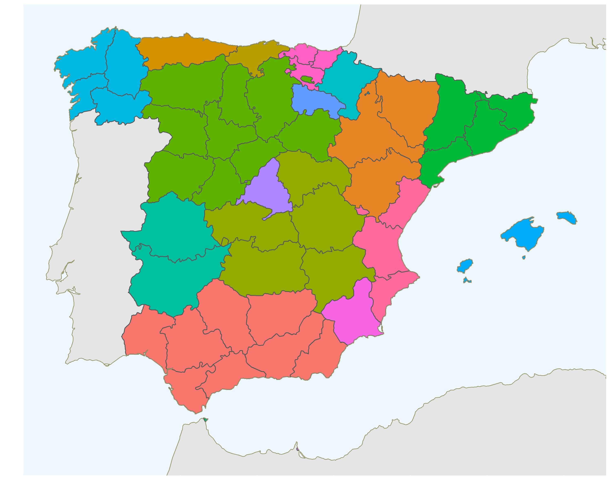
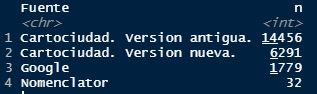

```{r setup, include = FALSE}
options(htmltools.dir.version = FALSE)
knitr::opts_chunk$set(message = FALSE, warning = FALSE, fig.align = "center")
xaringanExtra::use_tachyons()
```

# Contexto...

```{r, echo = FALSE, eval = TRUE, fig.asp = 2/2, out.width = "100%", fig.align = "center"}
knitr::include_graphics("./img/01_MonoFRA.jpg")
```

<br>

Cualquier ejercicio de accesibilidad (geográfica) tiene (al menos) 3 patas:

1. un **origen** por parte de quien accede,

1. una **ruta**, por algún medio de trasporte determinado, y

1. un **destino** al centro donde se accede.

<br>

--

¡Empezaremos por el final! La localización de los destinos.

???

Se trata también de ilustrar nuevas fuente de datos y tratamientos alternativos de la información.

---

# Preliminares

¿Que entendemos por **geocodificación**? Pues, ¡ponerlo en el mapa!

--

.pull-left[
**No** georeferenciado

```{r, echo = FALSE, eval = TRUE, fig.asp = 2/2, out.width = "100%", fig.align = "center"}

```

]

--

.pull-right[
**Si** georeferenciado

```{r, echo = FALSE, eval = TRUE, fig.asp = 2/2, out.width = "100%", fig.align = "center"}
knitr::include_graphics("./img/02_SiGeo.jpg")
```

]

--

En un sentido más **restringido** entendemos por **geocodificación** el proceso de convertir **direccione postales** en **coordenadas**.

---

### ¿Donde está el [Ivie](https://www.ivie.es/es_ES/)?

_Daniel Balaciart 3, Valencia, 46020, Valencia_

```{r echo = FALSE, out.width = "100%", fig.height = 6, eval = require("leaflet")}
library(leaflet)
leaflet() %>% addTiles() %>% setView(-0.3559, 39.4805, zoom = 18)
```


---

### Alternativamente

En el _CRS WGS84_ en **longitud** -0.3559º y **latitud** 39.4805º.

```{r echo = FALSE, out.width = "100%", fig.height = 6, eval = require("leaflet")}
IvieIcon <- makeIcon(iconUrl = "https://www.ivie.es/wp-content/uploads/2017/02/logo.jpg",
                     iconWidth = 45, iconHeight = 25,
                     iconAnchorX = 15, iconAnchorY = 25)
leaflet() %>% addTiles() %>% setView(lng = -0.3559, lat = 39.4805, zoom = 18) %>%
  addMarkers(lng = -0.3559, lat = 39.4805, icon = IvieIcon)
```

---

# _CRS: Coordinate Reference Systems_

La información geográfica siempre está necesariamente ligada a un **Sistema de Referencia de Coordenadas (_CRS_)**. Hay básicamente 2 grupos de _CRS_.

--

.pull-left[
**Geográficos**

```{r, echo = FALSE, eval = TRUE, fig.asp = 2/2, out.width = "80%", fig.align = "center"}
knitr::include_graphics("./img/vector_lonlat.png")
```

]

--

.pull-right[
**Proyectados**

```{r, echo = FALSE, eval = TRUE, fig.asp = 2/2, out.width = "80%", fig.align = "center"}
knitr::include_graphics("./img/vector_projected.png")
```

]

--

**IMPORANTE:** Siempre que trabajemos con información geográfica debemos asegurarnos que **toda la información** está en el **mismo _CRS_**.

---

class: inverse, center, middle

# Get Started

---

# Problema

Geocodificar el fichero de Oficinas bancarias de diciembre de 2020 del Banco de España: `Oficinas2020.csv`.

.center[22 558 oficinas. **¡_Real data_!**]

> _Classroom data are like teddy bears; real data are like a grizzly with salmon blood dripping out its mouth._ — [@JennyBryan]

.bg-washed-green.b--dark-green.ba.bw2.br3.shadow-5.ph4.mt4[
Inspecciona el fichero **`Oficinas2020.csv`**.
]

--

Debemos tener en cuenta que un proceso de **geocodificación** masiva es, además de engorroso y tedioso,...

- ...una operación imprecisa (dada la tecnología actual), y

- que habrá que proceder iterativamente. 

Los geocodificadores son **extremadamente caprichosos**.

---

# Estrategia

Antes de empezar **diseña una estrategia**:

--

1. Al `data.frame` original (_read only_) añade variables que vayan resumiendo el proceso de geocodificación, incluyendo si la observación ya está o no georeferenciada y suficiente información para poder rastrear el proceso de geocodificación.

--

1. Dedica suficiente tiempo a la **normalización** de las direcciones.

--

1. Controla la precisión espacial de los resultados. ¿Que margen de error espacial es aceptable?

--

1. Utiliza más de un geocodificador, pero fija con antelación el orden en el que serán llamados.

--

1. ¡No lo encontrarás todo! Si no quieres perder observaciones establece una base de datos de coordenadas de respaldo. ¡`r emo::ji("poop")`! ¿Existe eso?

---

# Anticipa los resultados a almacenar

.bg-washed-green.b--dark-green.ba.bw2.br3.shadow-5.ph4.mt3[
Inspecciona el _script_ **`00Oficinas_prepare.R`**.
]

```{r, eval = FALSE}
Oficinas <-
  mutate(tvia = normaliza_TVIA(tvia),
         Municipio = normaliza_ENT(Municipio, change.order = TRUE),
         ndir = normaliza_dir(tvia, nvia, npoli, Municipio, Provincia, CP),
         Longitud = NA_real_, Latitud = NA_real_,         #<<
         georef = NA_character_, comment = NA_character_, #<<
         Fuente = NA_character_,                          #<<
         Comentarios = NA_character_,                     #<<
         CalidadGeocodificacion = NA_character_,          #<<
         DireccionNormalizada = NA_character_)            #<<
```

---

# Direcciones

¡Las direcciones son la pieza clave de una geocodificación exitosa!

.bg-washed-green.b--dark-green.ba.bw2.br3.shadow-5.ph4.mt3[
Mira algunas direcciones del fichero **`Oficinas2020.csv`**.
]

--

**Normaliza** las direcciones antes de enviarlas al servicio de geocodificación. `r emo::ji("poop")`

--

Es útil pensar que una dirección postal se compone de 6 elementos:

1. **_tvia_**: tipo de vía

1. **_nvia_**: nombre de la vía

1. **_npoli_**: número de policía

1. **_muni_**: municipio

1. **_prov_**: provincia

1. **_codpost_**: Código Postal

---

# Direcciones: normalización

Cualquiera que sea tu formato original de direcciones: (_i_), ¡consigue los 6 elementos! -aunque sean cadenas vacías-, (_ii_) normaliza cada elemento y (_iii_) genera una dirección normalizada en la forma

.center[_tvia_ _nvia_ _npoli_, _muni_, _prov_, _codpost_]

¡Hay **funciones** para todo esto!

Se basan en lo que se denomina _regular expressions_.

La librería [_stringr_](https://stringr.tidyverse.org/reference/index.html) facilita notablemente el trabajo.

```{r, eval = FALSE}
Oficinas <- split_via_BdE(Oficinas$Direccion) %>%                            #<<
  select(-direcciones) %>%
  bind_cols(Oficinas, .) %>%
  mutate(tvia = normaliza_TVIA(tvia),                                        #<<
         Municipio = normaliza_ENT(Municipio, change.order = TRUE),          #<<
         ndir = normaliza_dir(tvia, nvia, npoli, Municipio, Provincia, CP))  #<<
```

---

# Direcciones: funciones

```{r, eval = FALSE}
split_via(via)
split_via_BdE(via)           # Especifica para el BdE #<<

normaliza_TVIA(TVIA)
normaliza_NVIA(NVIA)
normaliza_NPOLI(NPOLI)
normaliza_ENT(ENT, keep = c("left", "right"), change.order = FALSE)
normaliza_CP(CP)

normaliza_dir(tvia, nvia, npoli, muni, prov, codpost, CP.last = TRUE)
agita_dir(tvia, nvia, npoli, muni, prov, codpost, CP.last = TRUE, nivel, void = TRUE)

normaliza_Entidad(Entidad)   # Especifica para el BdE #<<
```

--

.bg-washed-green.b--dark-green.ba.bw2.br3.shadow-5.ph4.mt4[
Experimenta con las direcciones del fichero **`Oficinas2020.csv`**, y construye la dirección normalizada que enviarás al geocodificador.
]

---

# Geocodificadores

Ya tenemos las direcciones arregladitas, ¿que hacemos con eso?

Pues enviarlas a un **servicio** de geocodificación. El mundo de los servicios tiene _pros_ y _cons_, pero en este caso no hay alternativa, ¡dependemos de él!

Acceso mediante **API**: librería o programación.

--

### [Cartociudad](https://www.cartociudad.es/portal/) versus [Google](https://cloud.google.com/maps-platform)

.pull-left[
**Cartociudad**

1. Cobertura nacional.

1. Servicio gratuito.

1. _CRS_: ETRS89

1. Documentación de la [API](http://www.cartociudad.es/recursos/Documentacion_tecnica/CARTOCIUDAD_ServiciosWeb.pdf).
]

.pull-right[
**Google**

1. Cobertura mundial.

1. Servicio de pago.

1. _CRS_: WGS84

1. Documentación de la [API](https://developers.google.com/maps/documentation/geocoding/overview).
]

---

# Geocodificadores: funciones - [Cartociudad](https://www.cartociudad.es/portal/)

```{r, eval = FALSE}
#   Geocodificación masiva --> necesita analisis posterior
cartociudad_geocode(full_address, version = c("current", "prev"), progress = TRUE)

#   Geocodificación individual --> incluye regla de decisión
geocodificar_cartociudad(direc, poligono = NULL, buffer = NULL, progress = FALSE)
```

- `cartociudad_geocode()`: **geocodificación masiva** sin ningún control de calidad, de forma que este debe ser realizado _a posteriori_ en función de lo que devuelva el servidor.

- `geocodificar_cartociudad()`: **geocodificación individual**, pero **incluye una regla de decisión** en función de calidad de la respuesta, `state`, y **permite comprobar si la coordenada devuelta por el servidor cae dentro de un poligono**.

.bg-washed-green.b--dark-green.ba.bw2.br3.shadow-5.ph4.mt4[
Experimenta con ambas funciones y una muestra de direcciones normalizadas, `ndir`.
]

---

# Geocodificadores: funciones - [Google](https://cloud.google.com/maps-platform)

```{r, eval = FALSE}
#   Geocodificación masiva --> necesita analisis posterior
google_geocode(full_address, clave_google = NULL, progress = TRUE)

#   Geocodificación individual --> incluye regla de decisión
geocodificar_google(direc, clave_google = NULL, poligono = NULL, buffer = NULL, progress = FALSE)
```

`google_geocode()` y `geocodificar_google()` son **funciones análogas** a las de Cartociudad con (casi) idénticos parámetros de entrada y el mismo formato de la respuesta, de forma que los resultados de pueden acumular con `bind_rows()`.

¡La principal diferencia es que, dado que Google es un servicio de pago, requieren una API _key_!

Entre otras cosas, por esta razón, la geocodificación de las oficinas bancarias primero pasó por Cartociudad y luego por Google.

---

# Georeferenciación de Oficinas: _workflow_

- Se realiza un primer paso por [Cartociudad](https://www.cartociudad.es/portal/) utilizando el poligono del municipio como control de calidad espacial —si la coordenada no cae dentro del municipio se desecha—

```{r, eval = FALSE}
# 01Oficinas_Carto1.R
for(i in 1:n){
  poly <- Municipios2020 %>% filter(INECodMuni == Oficinas$CodMuni[i])
  g <- geocodificar_cartociudad(Oficinas$ndir[i], poligono = poly)       #<<
  Oficinas$georef[i]  <- g$georef
  Oficinas$comment[i] <- g$comment
  if (g$georef == 'SI'){
    Oficinas$Longitud[i] <- g$lng
    Oficinas$Latitud[i]  <- g$lat
    Oficinas$Fuente[i]   <- if_else(g$version == 'prev', 'Cartociudad. Version antigua.', 'Cartociudad. Version nueva.')
    Oficinas$Comentarios[i] <- paste0(g$stateMsg, ' (', g$state, '). Lugar: ', g$muni, ' (', g$province, ').')
    Oficinas$CalidadGeocodificacion[i] <- 'Coordenada en TM.'
    Oficinas$DireccionNormalizada[i] <- normaliza_dir(g$tip_via, g$address, g$portalNumber, g$muni, g$province, g$postalCode)
  }
}
```

---

# Georeferenciación de Oficinas: _workflow_

- Esta primera pasada georeferenció el 89.4% de las oficinas, 20 163, con lo que nos faltan por georeferenciar el 10.6% de las oficinas, 2 395.

- Si en la primera pasada no llegáis al 80% de tasa de éxito, o las direcciones no están bien tratadas o no tienen la suficiente calidad para acometer el proceso. ¡Volvemos a la casilla de salida!

- ¡Agita las direcciones y vuelvelas a pasar por Cartociudad!

--

```{r, eval = FALSE}
# 02Oficinas_Carto2.R
Oficinas <- Oficinas %>%
  mutate(vdir = agita_dir(tvia, nvia, npoli, Municipio, Provincia, CP, nivel = niv)) #<<
```

- **Agitando** las direcciones conseguimos georeferenciar 583 oficinas más. ¡Ya tenemos el 92.0%!, nos quedan 1 812 oficinas por georeferenciar, el 8.0%.

---

# Georeferenciación de Oficinas: _workflow_

- ¿Tiene Google algo que decir? Sí. Normalmente bastante. Las restantes las pasamos por Google, que encuentra 1 702 oficinas. ¡Nos quedan 110!


```{r, eval = FALSE}
# 03Oficinas_Google1.R
for(j in 1:totno.geo){
  i <- no.geo[j]
  poly <- Municipios2020 %>% filter(INECodMuni == Oficinas$CodMuni[i])
  g <- geocodificar_google(Oficinas$ndir[i], clave_google = APIkey, poligono = poly) #<<
  Oficinas$georef[i]  <- g$georef
  Oficinas$comment[i] <- g$comment
  if (g$georef == 'SI'){
    Oficinas$Longitud[i] <- g$lng
    Oficinas$Latitud[i]  <- g$lat
    Oficinas$Fuente[i] <- 'Google'
    Oficinas$Comentarios[i] <- paste0(g$stateMsg, ' (', g$state, '). Lugar: ', g$muni, ' (', g$province, ').')
    Oficinas$CalidadGeocodificacion[i] <- 'Coordenada en TM.'
    Oficinas$DireccionNormalizada[i] <- normaliza_dir(g$tip_via, g$address, g$portalNumber, g$muni, g$province, g$postalCode)
  }
}
```

---

# Georeferenciación de Oficinas: _workflow_

- Google tiene la ventaja de que admite POIs (_Points of Interest_), Cartociudad no.

- Probamos a añadir la `Entidad` entidad a la dirección.

```{r, eval = FALSE}
# 04Oficinas_Google2.R
# Añadimos la Entidad al principio de la direccion
direccion <- paste0(Oficinas$Entidad[i], ', ', Oficinas$ndir[i])  #<<
g <- geocodificar_google(direccion, clave_google = APIkey, poligono = poly)
```

- Lo que encuentra 77 coordenadas adicionales.

- ¡Nos quedan 33 oficinas por geocodificar, el 0.15%!

- Si podéis prescindir de 33 observaciones de 22 558 os haréis un favor, en caso contrario solo queda hacer una investigación individual, rebajar las exigencias, y/o acudir a la base de datos de coordenadas de respaldo. En este caso las coordenadas de la Capital del Municipio.

---

# Oficinas díscolas (1/3)

Llegados a este punto podemos dudar, de forma razonable, de todas las fuentes de información: El geocodificador puede no encontrar la dirección, las coordenadas devueltas pueden ser incorrectas, el fichero original puede tener errores -de hecho los tiene, ¡y muchos!—, y/o el fichero de lindes puede ser impreciso.

En este caso concreto se procedió de la siguiente forma:

- Después de pasar por Cartociudad y Google se examinaron individualmente las oficinas que no se consiguió georeferenciar.

- En particular, se vió donde devolvía el geocodificador coordenadas: _Spatial join_

```{r, eval = FALSE}
# 05Oficinas_Spatial_join.R
g_join <- st_as_sf(OficinasNO, coords = c('Longitud', 'Latitud'), crs = 4258) %>%
  st_join(Municipios2020)   #<<
```

---

# Oficinas díscolas (2/3)

- Se hicieron búsquedas manuales en Google y en los buscadores de las oficinas de cada entidad.

- Ello permitió corregir numerosos errores del fichero original del Banco de España<sup>*</sup>.

- Rebajando la precisión de la coordenada devuelta por Cartociudad, `state = 6`, se geocodificó 1 oficina más.

```{r, eval = FALSE}
# 06Oficinas_Carto4.R
g <- cartociudad_geocode(Oficinas$ndir[i], ver = "current", progress = FALSE)
  if (g$state == 6) # Aceptamos la coordenada con menor precisión #<<
```

- Se mantuvo el criterio de que todas las coordenadas debían "caer" en el término municipal de acuerdo con el mapa del IGN. ¡Aún a sabiendas de que el mapa no es perfecto y contiene errores!


.footnote[(*) Esto se hizo en iteraciones anteriores del proceso.]

---

# Oficinas díscolas (3/3)

- Finalmente, para 32 oficinas, se asignó la **coordenada de la Capital del Municipio**<sup>*</sup>.

Lo que cierra el proceso (iterativo) de georeferenciación.

<br/>

----

.footnote[(*) Esta información procede del Nomenclátor geografico del IGN y se comprobó que las coordenadas caen donde deben hacerlo.]

--

<br/>

- La distribución final del origen de las coordenadas es

```{r, echo = FALSE, eval = TRUE, out.width = "40%", fig.align = "center"}

```


---

# Comprobaciones finales

Es **importante** realizar **dos comprobaciones finales**:

- Comprobar que **todas las coordenadas caen dentro de la precisión espacial fijada** en la estrategia inicial<sup>*</sup>.

```{r, eval = FALSE}
# 07Oficinas_final.R
OfiMuni <- Oficinas %>%
  st_as_sf(coords = c("Longitud", "Latitud"), crs = 4258) %>%
  st_intersection(Municipios2020)  # Una interseción espacial hace el trabajo #<<
sum(OfiMuni$CodMuni != OfiMuni$INECodMuni)
```

.footnote[(*) Si hay excepciones se deberá dejar registro de ello.]

--

- Comprobar **duplicados por coordenada**. Muy útil para detectar errores. 

```{r, eval = FALSE}
# 07Oficinas_final.R
duplicados <- Oficinas %>%
  janitor::get_dupes(CodMuni, Municipio, CodEnt, Entidad, Longitud, Latitud) #<<
```

---

class: inverse, center, middle

# ¿Para que sirve todo esto?

---

### Para pintar oficinas en el mapa...

```{r echo = FALSE, out.width = "100%", fig.height = 6, eval = require("leaflet")}
Oficinas <- sf::read_sf("./data/Oficinas2020geoIvie.gpkg") %>%
  sf::st_transform(crs = 4326)
leaflet(Oficinas) %>% addTiles() %>% setView(lng = -0.3559, lat = 39.4805, zoom = 18) %>%
  addMarkers(lng = -0.3559, lat = 39.4805, icon = IvieIcon) %>%
  addMarkers(clusterOptions = markerClusterOptions(), popup = ~ Entidad)
```

---

### ...y para hacer cálculos geográficos.

```{r echo = FALSE, out.width = "100%", fig.height = 6, eval = require("leaflet")}
route <- osrm::osrmRoute(src = c(-0.3559, 39.4805), dst = Oficinas[188, ], returnclass = "sf", osrm.profile = "foot")
leaflet() %>% addTiles() %>% setView(lng = -0.3594, lat = 39.4805, zoom = 16) %>%
  addMarkers(lng = -0.3559, lat = 39.4805, icon = IvieIcon) %>%
  addMarkers(data = Oficinas, clusterOptions = markerClusterOptions(), popup = Oficinas$Entidad) %>%
  addPolylines(data = route, color = "red") %>%
  addLabelOnlyMarkers(lng = -0.3587, lat = 39.4807, label = "1km & 12m", labelOptions = labelOptions(noHide = TRUE,
                      textOnly = TRUE, style = list("color" = "red"), textsize = "12px"))
```

---
background-image: url(https://www.ivie.es/wp-content/uploads/2017/02/logo.jpg), url(https://www.uv.es/recursos/fatwirepub/css/logoPeu.png)
background-position: 95% 5%, 5% 95%
background-size: 12%, 20%

class: center, middle


# ¡Gracias por la atención!

## .green[¿Preguntas?]

???

Slides created via the R package [**xaringan**](https://github.com/yihui/xaringan).

